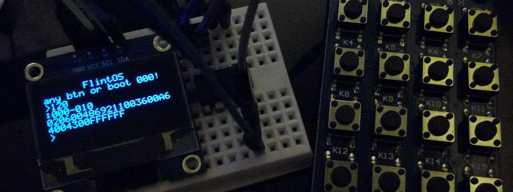

# FlintOS

A very basic operating system for ATtiny85 et al.

*Demonstrating the 'binary reader' program: accept two 9-bit addresses, read EEPROM bytes between them.*

## Features

**Execution**:
* Executes one program at a time
* Programs are loaded from EEPROM
* automatically boots into address 000, or accepts address from user
* Instruction set with 50+ op codes

**Input**:
* Supports [Waveshare's AD Keypad](https://www.waveshare.com/wiki/AD_Keypad) for user 4-bit input

**Display**:
* Uses a modified version of [Tinusaur's ssd1306xled library](https://bitbucket.org/tinusaur/ssd1306xled) for both 128x64 and 64x32 SSD1306 OLED displays

**IO**:
* Provides R/W access to IO pins as analog/digital
* Provides EEPROM access
